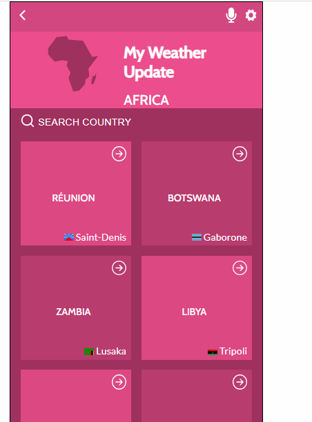

# Weather-App

>> A weather application that display weather updates of different capital cities

The weather updates is fetched from [Open Weather API](https://openweathermap.org/api).

## DEMO


## 🔴 [LIVE LINK](https://62b9c319ef5d2f4fb550e3fb--heartfelt-tapioca-356bb6.netlify.app/)


## Project Features

- Displays list of countries, flag and capital city
- Display weather updates of each countr's capital city

## VIDEO

A video description of the project 
[Loom](https://www.loom.com/share/5bb93ae6722e474f81600b04dd7ee8ce)

## Built With 🔨

- HTML - CSS - JavaScript(ES6)
- React
- Redux

## Setup

### Clone this repository

```bash
$ git clone https://github.com/jmoseka/weather-app.git
$ cd Meals-A-Day
```

### Run project

```bash
$ npm install
$ npm run start
```

### Prerequisites

- IDE (VCode For me 🔥).
- Git and GitHub
- npm and node.js installed.

## Authors

👤 **Jamila Moseka**

- GitHub: [@jmoseka](https://github.com/jmoseka)
- Twitter: [milamoseka](https://twitter.com/milamoseka)
- LinkedIn: [jamila-moseka](https://www.linkedin.com/in/jamila-moseka/)

## 🤝 Contributing

Contributions, issues and feature requests are welcome!

## Show your support

Give a ⭐️ if you like this project!

## Acknowledgments

Original design idea is by Nelson Sakwa in [Behance](https://www.behance.net/gallery/31579789/Ballhead-App-(Free-PSDs)).

## 📝 License

This project is [MIT](./MIT.md) licensed.
